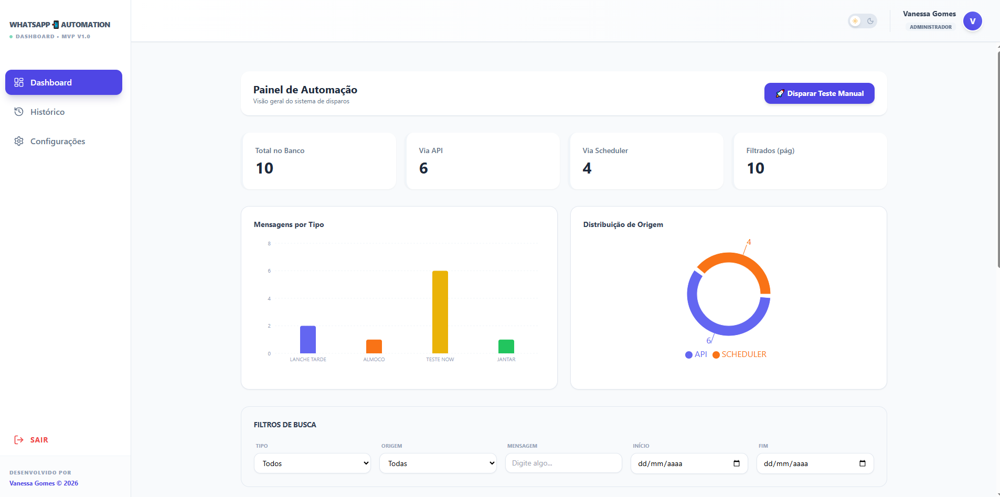
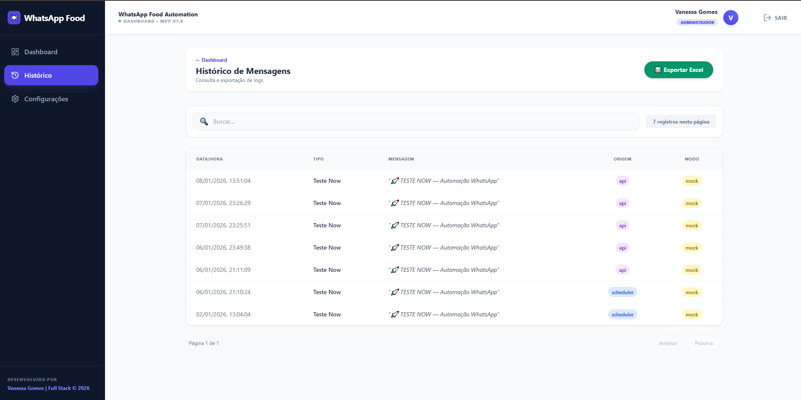
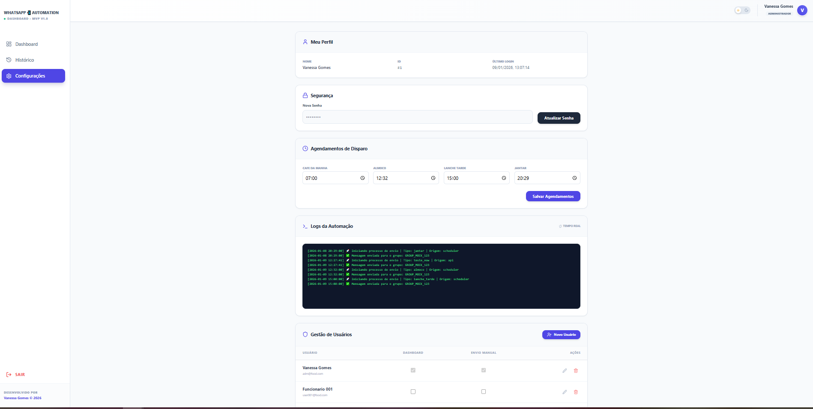

# WhatsApp Food Automation - Full Stack MVP 🍽️📲

Este é um ecossistema completo para automação de disparos de mensagens para restaurantes e comércios alimentícios. O sistema conta com um motor de agendamento inteligente (Back-end) e um painel administrativo profissional com controle de acesso (Front-end).

## 📸 Demonstração do Sistema

<div align="center">
  
  
  
</div>

#### 🛠️ Detalhes Técnicos das Telas:

* **Dashboard de Métricas**: Painel desenvolvido com **Recharts** para análise de dados em tempo real. Implementa lógica de filtros complexos por tipo de refeição (Café, Almoço, Jantar) e origem do disparo (API ou Scheduler), com proteção de rota via `AuthGuard`.
* **Histórico de Disparos**: Interface de monitoramento com suporte a paginação e busca global. Exibe o status de cada mensagem e utiliza componentes customizados como `StatusBadge` para uma experiência visual clara e moderna (SaaS Style).
* **Gestão & Permissões (RBAC)**: Sistema de controle de acesso baseado em cargos. Permite ao Administrador gerenciar a equipe e atribuir permissões granulares como "Acesso ao Dashboard" ou "Envio Manual de Testes", com persistência em `localStorage`.

---

## 🚀 Funcionalidades Principais

- **🔒 Autenticação e Segurança**: Login persistente com controle de sessão e proteção de rotas privadas.
- **🛡️ Permissões Granulares (RBAC)**: Diferenciação entre níveis de acesso (Admin vs Funcionário).
- **⏱️ Agendamento Inteligente**: Backend em Python com APScheduler para disparos automáticos.
- **🌓 Dark Mode Nativo**: Suporte completo a temas claro e escuro com persistência de preferência via Context API.
- **📱 Interface Mobile-First**: Sidebar retrátil e layout adaptável para smartphones, tablets e desktop.
- **📊 Gráficos Inteligentes**: Visualização de dados por categoria com paleta de cores dinâmica para facilitar a leitura.

---

### 📋 Pré-requisitos
Antes de começar, você vai precisar ter instalado:
- **Python 3.10+** (Backend)
- **Node.js 18+** (Frontend)
- **Docker & Docker Compose** (Opcional)

## 🐳 Rodando com Docker (Recomendado)
A maneira mais rápida de subir o ecossistema completo:

- 1. Na raiz do projeto, execute:
```bash
docker-compose up --build
```
- 2. O Dashboard estará disponível em: http://localhost:5173.

- 3. A API estará disponível em: http://localhost:8000.

## 🐍 Instalação Manual (Backend)
Se preferir rodar sem Docker:

- 1. Entre na pasta: cd backend.
- 2. Instale as dependências:
```bash
pip install -r requirements.txt
```
(Este arquivo contém todas as bibliotecas necessárias como FastAPI e APScheduler).

- 3. Inicie o servidor:
```bash
python -m app.main
```
- Dashboard: http://localhost:5173 | API: http://localhost:8000

## 💻 Instalação Manual (Frontend)

```bash
cd frontend
npm install
npm run dev
```
- Acesse o Dashboard em: http://localhost:5173

### 🏗️ Estrutura do Repositório
- /backend: API em Python (FastAPI) com motor de agendamento e persistência de logs.

- /frontend: SPA em React (Vite) com Context API e Tailwind CSS.

- /assets: Documentação visual e assets do projeto.

---
<div align="center"> <p>Desenvolvido por <b>Vanessa Gomes</b> | Desenvolvedora Full Stack © 2026</p> </div>
